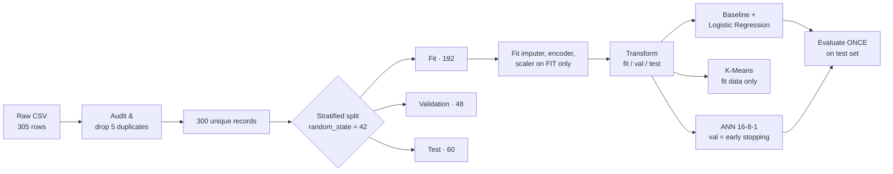

<div align="center">

# 📈 Campaign Response Prediction & Audience Segmentation

### Data Science & AI/ML — Final Practical Exam (Set A)
*Red & White Skill Education*


**👤 Student:** `MAITRAK KUNJADIA` &nbsp;|&nbsp; **🆔 Student ID:** `10015` &nbsp;|&nbsp; **📄 Set:** `A`

**🎥 Video:** [`PASTE-VIDEO-URL`](PASTE-VIDEO-URL) &nbsp;|&nbsp; **⏱ Duration:** `3:00 HOURS`

</div>

---

## 📑 Table of Contents

1. [Objective](#-objective)
2. [Results at a Glance](#-results-at-a-glance)
3. [Workflow](#-workflow)
4. [Dataset & Data Dictionary](#-dataset--data-dictionary)
5. [Setup & How to Run](#-setup--how-to-run)
6. [Repository Structure](#-repository-structure)
7. [Module 1 — Maths & Statistics](#-module-1--maths--statistics)
8. [Module 2 — Preprocessing & Feature Engineering](#-module-2--preprocessing--feature-engineering)
9. [Module 3 — Supervised Learning](#-module-3--supervised-learning)
10. [Module 4 — Unsupervised Learning](#-module-4--unsupervised-learning)
11. [Module 5 — ANN (Deep Learning)](#-module-5--ann-deep-learning)
12. [Model Comparison & Reconciliation](#-model-comparison--reconciliation)
13. [Conclusions, Recommendation & Limitations](#-conclusions-recommendation--limitations)
14. [Loading the Saved Models](#-loading-the-saved-models)
15. [References & Declaration](#-references--declaration)

---

## 🎯 Objective

A marketing team wants to **predict which customers will respond to a campaign** (`response = 1`) and **discover audience segments** to target them better. This project covers the full data-science pipeline on a synthetic dataset:

| # | Module | Goal |
|---|--------|------|
| 1 | Maths & Stats | Descriptive stats, Welch t-test, confidence interval, covariance & eigenvalues |
| 2 | Preprocessing | Audit, dedupe, leak-free split, imputation, encoding, feature engineering, scaling |
| 3 | Supervised | Majority-class baseline vs. Logistic Regression |
| 4 | Unsupervised | K-Means (k = 2, 3, 4) with silhouette-based selection |
| 5 | Deep Learning | Dense ANN (16 → 8 → 1) with early stopping |

> ⚠️ All data is **synthetic practice data**. Nothing here is a causal claim or a deployment-ready result.

---

## 🏆 Results at a Glance

| 🔑 Finding | Value |
|---|---|
| Clean dataset | **300** unique records (305 raw − 5 exact duplicates) |
| Partitions (fit / validation / test) | **192 / 48 / 60** |
| Baseline test accuracy (majority class) | **0.583** |
| Logistic Regression — accuracy / F1 | **0.817 / 0.845** |
| ANN — accuracy / F1 | **0.833 / 0.861** |
| Best K-Means k (by silhouette) | **k = 2** (silhouette = 0.226) |
| Welch t-test, engagement G1 vs G2 | t = 0.723, p = 0.471 → **fail to reject H0** |
| ANN trainable parameters | **273** |

---

## 🔄 Workflow



### 🔒 Leakage prevention rules

- ✅ Imputer, encoder and scaler are **fitted on the 192 fit records only**, then reused unchanged on validation and test.
- ✅ `engineered_feature` is calculated **after imputation** and **before scaling**, from predictors only — the target is never used.
- ✅ `record_id` and `response` are **excluded** from all model inputs.
- ✅ The 48 validation records are used **only** for ANN early stopping.
- ✅ The 60 test records are evaluated **once** per model. No tuning, no seed shopping.

---

## 📊 Dataset & Data Dictionary

The dataset is created by `src/generate_data.py` (supplied, unchanged, seed `404`) and saved to `data/raw/set_d.csv`. The raw file is **never modified**.

| Column | Type | Role | Description |
|---|---|---|---|
| `record_id` | int | 🚫 Identifier | Unique ID 1–300. **Excluded from all models.** |
| `visits` | float | Predictor | Synthetic index measurement (16 missing in raw) |
| `recency` | float | Predictor | Synthetic index measurement (15 missing in raw) |
| `engagement` | float | Predictor | Synthetic index measurement |
| `spend` | float | Predictor | Synthetic index measurement |
| `group` | category | Predictor | Operational cohort: `G1` / `G2` (one-hot encoded) |
| `response` | 0 / 1 | 🎯 Target | 1 = responded, 0 = did not respond |
| `engineered_feature` | float | Predictor (derived) | `engagement / (recency + 1)` |

> The numeric columns are dimensionless synthetic indices — they are **not** physical units.

### 🧹 Data audit

| Check | Result |
|---|---|
| Raw shape | 305 rows × 7 columns |
| Exact duplicates | 5 |
| Missing values | `visits` = 16, `recency` = 15 (all other columns complete) |
| Clean shape | 300 rows × 7 columns |
| Unique `record_id` after cleaning | 300 ✔ |
| Target counts (clean) | 173 responders (57.7%), 127 non-responders (42.3%) |

### ✂️ Data split (`random_state = 42`, stratified)

```
300 clean records
├── 240 train_full (80%)
│   ├── 192 FIT         → fit preprocessing + train models
│   └──  48 VALIDATION  → ANN early stopping only
└──  60 TEST (20%)      → final one-time evaluation
```

Record IDs for each partition are saved in `outputs/splits.csv`; the three sets are verified to be **disjoint**.

---

## ⚙️ Setup & How to Run

Run every command **from the repository root**.

```bash
# 1. Clone
git clone https://github.com/YOUR-USERNAME/ds-aiml-set-d-YOUR-STUDENT-ID.git
cd ds-aiml-set-d-YOUR-STUDENT-ID

# 2. Create and activate a virtual environment
python -m venv .venv
source .venv/bin/activate          # Windows: .venv\Scripts\activate

# 3. Install packages
pip install -r requirements.txt

# 4. Generate the raw data (creates data/raw/set_d.csv)
python src/generate_data.py

# 5. Run the notebook (clean kernel, Run All)
jupyter notebook notebooks/exam.ipynb
```

### 🧰 Tools & versions

| Package | Version |
|---|---|
| Python | `x.y.z` |
| numpy | `x.y.z` |
| pandas | `x.y.z` |
| scipy | `x.y.z` |
| scikit-learn | 1.8.0 |
| matplotlib | `x.y.z` |
| tensorflow / keras | `x.y.z` |

> Fill in the exact versions from `pip freeze` / the notebook's version printout, and keep them in sync with `requirements.txt`.

---

## 🗂 Repository Structure

```
ds-aiml-set-d-YOUR-STUDENT-ID/
├── README.md                  # this file
├── requirements.txt           # package versions
├── .gitignore                 # environments, caches, secrets
├── src/
│   └── generate_data.py       # supplied generator (unchanged)
├── data/
│   └── raw/
│       └── set_d.csv          # original data (duplicates + missing values kept)
├── notebooks/
│   └── exam.ipynb             # executed notebook, five module sections
├── outputs/
│   ├── splits.csv             # record_id → fit / validation / test
│   ├── logreg_predictions.csv # per-record test predictions (Logistic Regression)
│   ├── ann_predictions.csv    # per-record test predictions (ANN)
│   ├── metrics_comparison.csv # baseline vs LogReg vs ANN
│   ├── k_selection.csv        # inertia + silhouette for k = 2, 3, 4
│   ├── cluster_profiles.csv   # mean feature values per cluster
│   └── figures/               # histogram, confusion matrices, loss curves
└── models/
    └── ann.keras              # trained ANN (+ fitted preprocessing)
```

---

## 📐 Module 1 — Maths & Statistics

*All calculations use the 192 fit records and observed (non-imputed) values.*

### M1 — Descriptive statistics of `engagement`

| n (observed) | Mean | Median | Std (ddof = 1) |
|:---:|:---:|:---:|:---:|
| 192 | 51.002 | 51.405 | 10.289 |

📉 Histogram: `outputs/figures/engagement_hist.png`

The mean and median are very close, so the distribution looks roughly symmetric.

### M2 — Statistical inference

**Welch two-sample t-test (two-sided, α = 0.05)**

- **H0:** mean engagement of G1 = mean engagement of G2
- **H1:** mean engagement of G1 ≠ mean engagement of G2

| n (G1) | n (G2) | t statistic | p-value | Decision |
|:---:|:---:|:---:|:---:|:---:|
| 84 | 108 | 0.723 | 0.471 | Fail to reject H0 |

**95% t-confidence interval for the overall mean engagement:** **[49.54, 52.47]**

**Interpretation**
- Since p = 0.471 > 0.05, there is **no statistical evidence** of a difference in mean engagement between G1 and G2 in this sample. This does *not* prove the means are equal.
- We are 95% confident (in the repeated-sampling sense) that the interval [49.54, 52.47] captures the true mean engagement of the population these records represent.
- **Assumptions:** records are independent, and engagement is approximately normal within groups. The near-equal mean/median and n > 80 per group make the normality assumption reasonable.
- No causal claim is made.

### M3 — Linear algebra (covariance & eigenvalues)

Using the 181 fit rows complete for `engagement` and `visits`, the data were centered manually and the covariance matrix was computed as `Xc.T @ Xc / (n − 1)`:

|  | engagement | visits |
|---|:---:|:---:|
| **engagement** | 103.657 | 4.118 |
| **visits** | 4.118 | 103.061 |

- Eigenvalues (via `np.linalg.eigh`): **99.230** and **107.488**
- **Largest eigenvalue ÷ sum = 0.520 (52.0%)**

**Interpretation:** The first principal direction is almost an equal blend of engagement and visits, and it captures only about 52% of the total variance. That is barely more than the 50% expected from two uncorrelated variables, so the two features are **nearly uncorrelated** and there is no strong redundancy to compress.

---

## 🧪 Module 2 — Preprocessing & Feature Engineering

| Step | Method | Fitted on |
|---|---|---|
| Missing values | `SimpleImputer(strategy="median")` on the 4 numeric columns | Fit only |
| Feature engineering | `engineered_feature = engagement / (recency + 1)` (after imputation, original scale) | — (deterministic) |
| Scaling | `StandardScaler` on the 5 numeric features | Fit only |
| Categorical | `OneHotEncoder(handle_unknown="ignore")` on `group` — left **unscaled** | Fit only |

**Transformed output**

| Partition | Shape |
|---|---|
| Fit | (192, 7) |
| Validation | (48, 7) |
| Test | (60, 7) |

**Feature order:** `visits`, `recency`, `engagement`, `spend`, `engineered_feature`, `group_G1`, `group_G2`

✅ All transformed values are finite.

**Why these exclusions matter**
- **Target (`response`)** — using it as an input would let the model "read the answer".
- **`record_id`** — an arbitrary label with no predictive meaning; it would only add noise or leak row order.
- **Test statistics** — computing medians/means/scales with test rows would leak holdout information into training and inflate scores.

---

## 🤖 Module 3 — Supervised Learning

**Target:** `response` (1 = responded) &nbsp;|&nbsp; **Predictors:** the 7 transformed features &nbsp;|&nbsp; **Threshold:** 0.5

| Model | Settings |
|---|---|
| Baseline | `DummyClassifier(strategy="most_frequent")` |
| Classifier | `LogisticRegression(max_iter=1000, random_state=42)` |

Precision/recall/F1 use `zero_division=0` so an undefined value (no predicted or no actual positives) is reported as 0 instead of raising an error.

### 📋 Test-set results (60 records)

| Model | Accuracy | Precision | Recall | F1 |
|---|:---:|:---:|:---:|:---:|
| Baseline (majority class) | 0.583 | 0.583 | 1.000 | 0.737 |
| **Logistic Regression** | **0.817** | **0.833** | **0.857** | **0.845** |

### Confusion matrix — Logistic Regression

|  | Predicted: No response | Predicted: Response |
|---|:---:|:---:|
| **Actual: No response** | 19 (TN) | 6 (FP) |
| **Actual: Response** | 5 (FN) | 30 (TP) |

📷 `outputs/figures/logreg_confusion_matrix.png`

### 💡 Interpretation

- **False positive** (predict response, actually none): the campaign contacts someone who ignores it → wasted marketing spend and a slightly annoyed customer.
- **False negative** (predict no response, actually would respond): a responsive customer is missed → lost revenue opportunity.
- The baseline reaches 58.3% accuracy just by always predicting "response". Logistic Regression lifts accuracy by **~23 percentage points** (0.583 → 0.817) and correctly separates non-responders, which the baseline never does (its recall is 1.0 only because it predicts everything as positive). This is a **useful improvement** — though on only 60 test records the estimate is uncertain.

---

## 🧩 Module 4 — Unsupervised Learning

**Input:** the 5 scaled numeric fit features (`visits`, `recency`, `engagement`, `spend`, `engineered_feature`). Group one-hot columns, target and ID are excluded. Test data and labels are never used.

`KMeans(n_init=10, random_state=42)`

| k | Inertia | Silhouette |
|:---:|:---:|:---:|
| **2** | 713.030 | **0.226** ✅ |
| 3 | 613.551 | 0.187 |
| 4 | 541.645 | 0.191 |

**Chosen k = 2** — the highest silhouette (ties would go to the smaller k). Inertia always falls as k grows, so it cannot be used alone to pick k. A silhouette of 0.226 signals **weak, overlapping structure**; these segments are a practical grouping tool, not sharply separated natural clusters.

### 👥 Cluster profiles (mean of original-scale values, fit data)

| Cluster | n | visits | recency | engagement | spend | engineered_feature |
|:---:|:---:|:---:|:---:|:---:|:---:|:---:|
| 0 | 109 | 49.37 | 55.25 | 46.09 | 50.18 | 0.83 |
| 1 | 83 | 49.54 | 44.17 | 57.45 | 50.97 | 1.29 |

### 🏷 Segment names & actions

| Cluster | Name | Profile | Suggested action |
|:---:|---|---|---|
| 0 | **Cooling Low-Engagement** | Higher recency values, lower engagement | Run a win-back / re-engagement offer before the main campaign |
| 1 | **Active Engaged** | Lower recency values, higher engagement | Prioritize for the main campaign; loyalty or upsell messaging |

> ℹ️ Cluster IDs (0, 1) are **arbitrary labels** assigned by the algorithm. They do **not** correspond to the target classes (response / no response), and the target was not used to build them.

---

## 🧠 Module 5 — ANN (Deep Learning)

### Architecture

```
Input (7)  →  Dense(16, ReLU)  →  Dense(8, ReLU)  →  Dense(1, Sigmoid)
```

| Layer | Output shape | Parameters |
|---|:---:|:---:|
| Dense (ReLU) | (None, 16) | 128 |
| Dense (ReLU) | (None, 8) | 136 |
| Dense (Sigmoid) | (None, 1) | 9 |
| **Total trainable** | | **273** |

**Why sigmoid + binary cross-entropy?** The task is binary classification. The sigmoid squashes the output to (0, 1) so it reads as P(response = 1), and binary cross-entropy is the matching log-loss for a Bernoulli target.

### Training setup

| Setting | Value |
|---|---|
| Optimizer | Adam, learning rate 0.001 |
| Loss | `binary_crossentropy` |
| Batch size | 16 |
| Max epochs | 50 |
| Early stopping | monitor `val_loss`, patience 5, `restore_best_weights=True` |
| Training data | 192 fit records |
| Validation data | 48 reserved validation records |
| Random seed | **42** |
| Epochs actually run | **50** (early stopping did not trigger) |

📉 Loss curves: `outputs/figures/ann_loss_curves.png`

**Reading the curves:** early stopping did not fire, so validation loss never went 5 consecutive epochs without improving. Check the figure for a widening gap between training and validation loss (overfitting) or both curves staying high (underfitting), and note that with only 48 validation records the validation curve is noisy.

### Test-set results

| Accuracy | Precision | Recall | F1 |
|:---:|:---:|:---:|:---:|
| 0.833 | 0.838 | 0.886 | 0.861 |

Confusion matrix (ANN):

|  | Predicted: No response | Predicted: Response |
|---|:---:|:---:|
| **Actual: No response** | 19 (TN) | 6 (FP) |
| **Actual: Response** | 4 (FN) | 31 (TP) |

---

## ⚖️ Model Comparison & Reconciliation

### Final held-out comparison (same 60 test records)

| Model | Accuracy | Precision | Recall | F1 |
|---|:---:|:---:|:---:|:---:|
| Baseline | 0.583 | 0.583 | 1.000 | 0.737 |
| Logistic Regression | 0.817 | 0.833 | 0.857 | 0.845 |
| **ANN** | **0.833** | **0.838** | **0.886** | **0.861** |

### Model preference

The ANN scores slightly higher (F1 0.861 vs 0.845), but the gap equals **a single test record** (one fewer false negative). On 60 records that difference is well within noise. **Logistic Regression is the preferred model**: it is simpler, faster, more interpretable and nearly as accurate. The ANN would only be worth its extra complexity if a larger holdout confirmed a consistent gain.

### ✅ Reconciliation checks

| Check | Result |
|---|---|
| Both models use identical test IDs, in the same order | ✔ `True` |
| Logistic Regression F1 recomputed from `logreg_predictions.csv` | 0.8451 (matches table) |
| ANN F1 recomputed from `ann_predictions.csv` | 0.8611 (matches table) |
| Confusion-matrix counts from saved predictions | LogReg 19/6/5/30, ANN 19/6/4/31 (TN/FP/FN/TP) |

---

## 🏁 Conclusions, Recommendation & Limitations

### 🔢 Two numerical findings
1. **Both models clearly beat the baseline:** Logistic Regression reached accuracy 0.817 and the ANN 0.833, versus 0.583 for always predicting the majority class.
2. **No detectable engagement difference between cohorts:** Welch t-test p = 0.471 (G1 n = 84, G2 n = 108), and the 95% CI for mean engagement is [49.54, 52.47].

### ✅ Recommendation
Use **Logistic Regression** to rank customers for the campaign, and combine it with the two K-Means segments: target *Active Engaged* customers first and send a re-engagement offer to *Cooling Low-Engagement* customers.

### ⚠️ Limitations
- Only **60 test records**: a single-record change shifts accuracy by ~1.7 points, so model differences are not statistically reliable.
- The data is **synthetic**; results say nothing about real customers.
- K-Means silhouette is low (0.226), so segments overlap heavily.
- Findings are associations only — **no causal claims** and **no deployment readiness** are implied.

---

## 💾 Loading the Saved Models

```python
import numpy as np
import pandas as pd
from tensorflow import keras

# Saved ANN
ann = keras.models.load_model("models/ann.keras")

# Predict on already-transformed features (same 7-column order as above)
prob = ann.predict(X_new).ravel()
label = (prob >= 0.5).astype(int)
```

To rebuild the preprocessing (median imputer → `engineered_feature` → `StandardScaler` + one-hot `group`), run the **Task 2** section of `notebooks/exam.ipynb` — it re-fits everything on the 192 fit records from `outputs/splits.csv` with `random_state=42`.

---

## 📚 References & Declaration

- Exam paper: *Data Science & AI/ML — Final Practical Exam, Set A* (Red & White Skill Education)
- [scikit-learn documentation](https://scikit-learn.org/stable/)
- [SciPy `stats` documentation](https://docs.scipy.org/doc/scipy/reference/stats.html)
- [TensorFlow / Keras documentation](https://www.tensorflow.org/api_docs/python/tf/keras)

> **Declaration:** All work is my own except where cited.

<div align="center">

*Made with 🐍 Python · Quality is our Motto*

</div>
